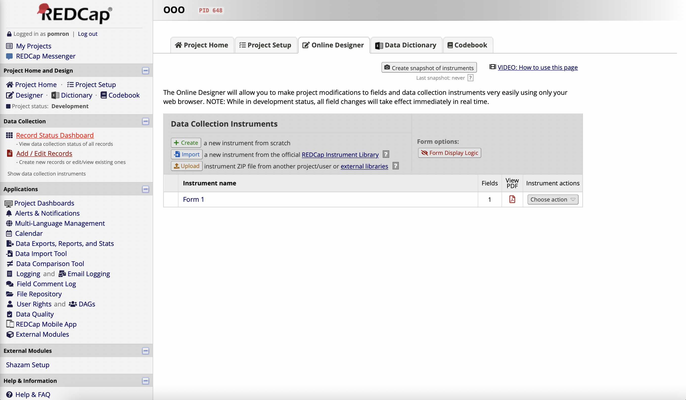
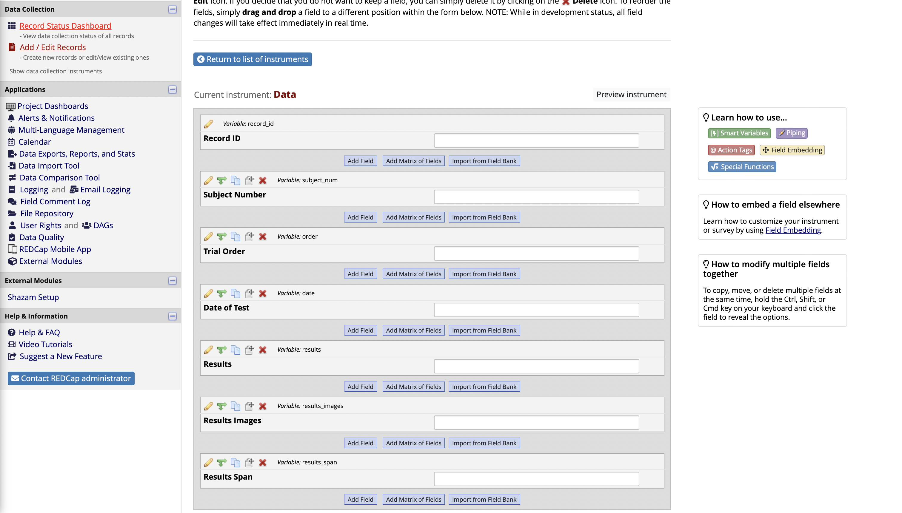
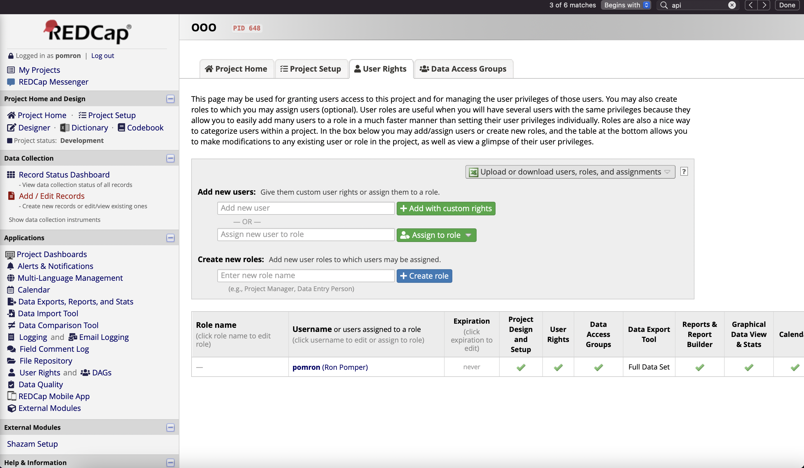
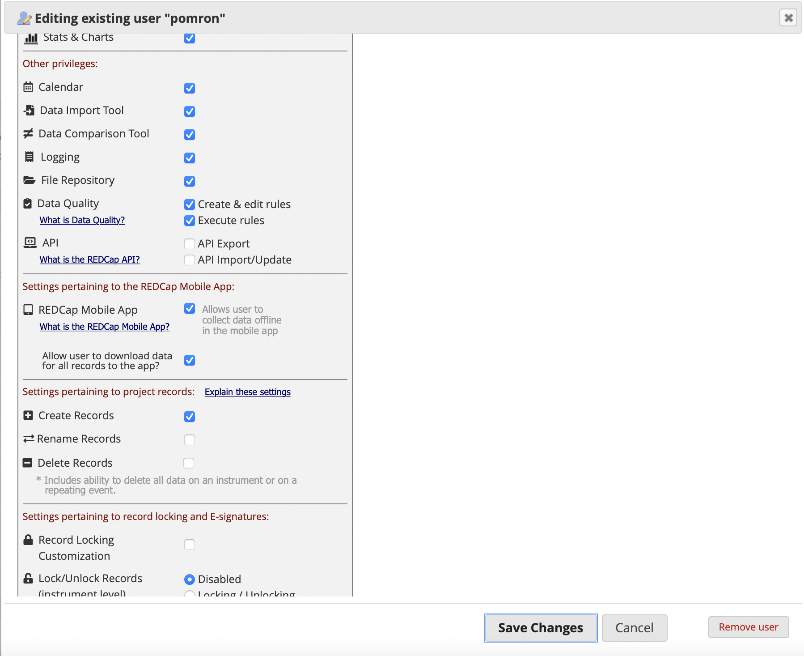
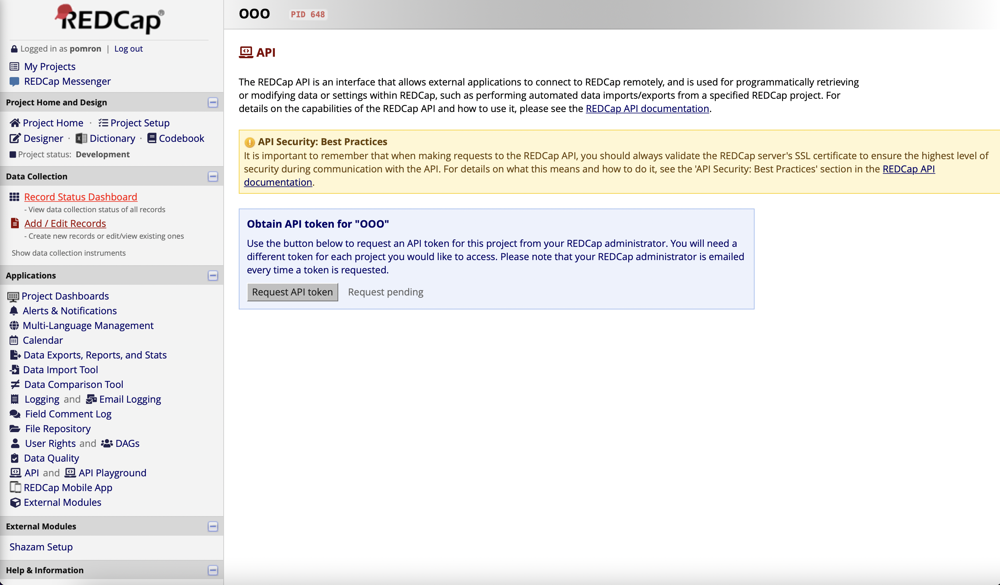
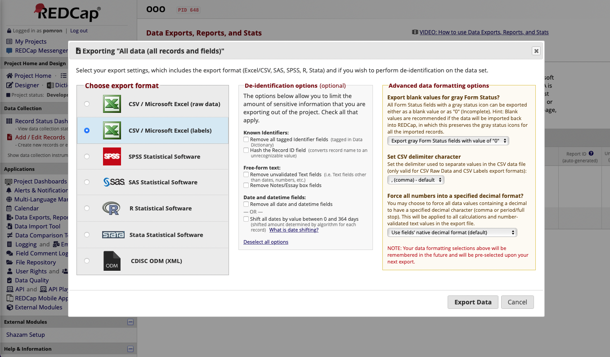
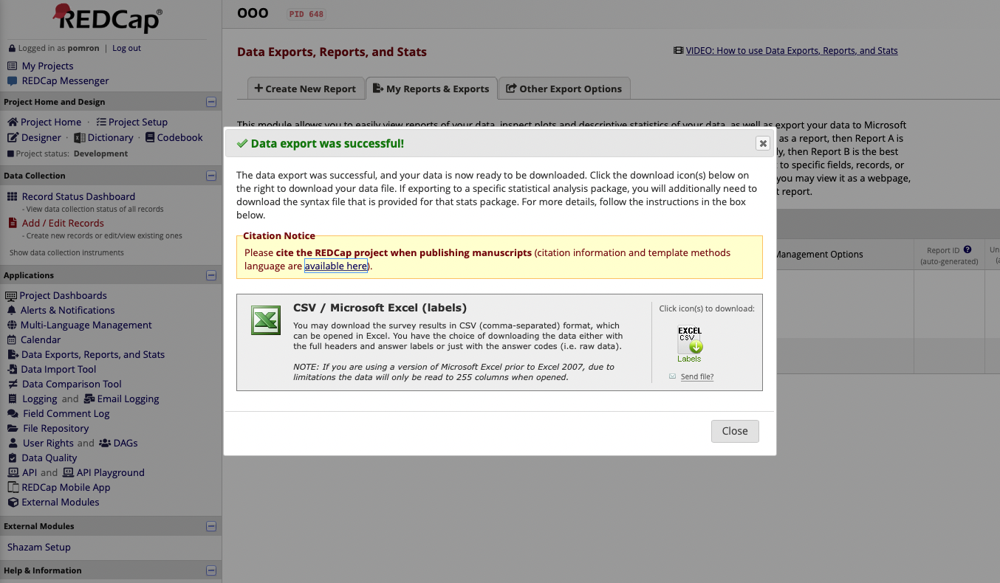
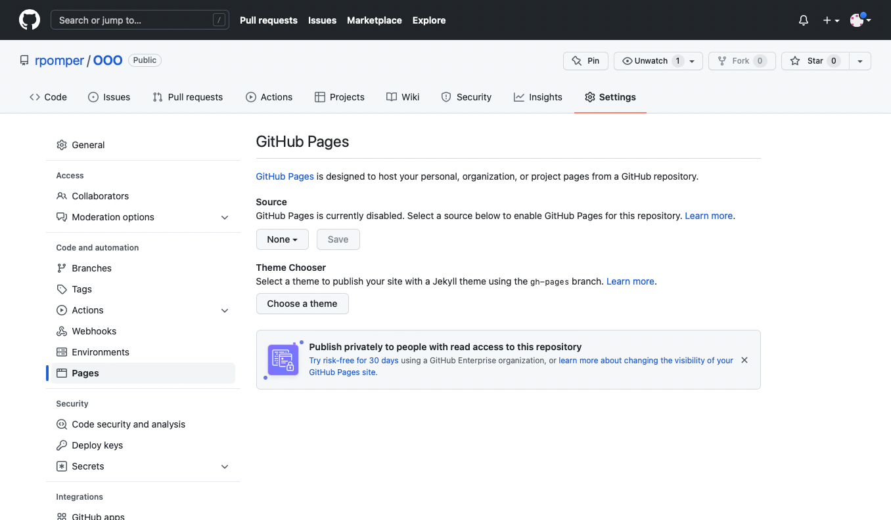
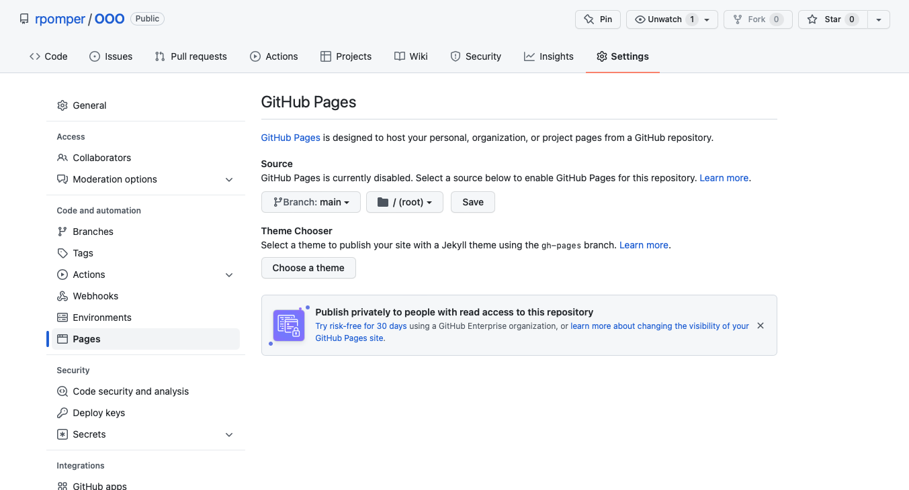
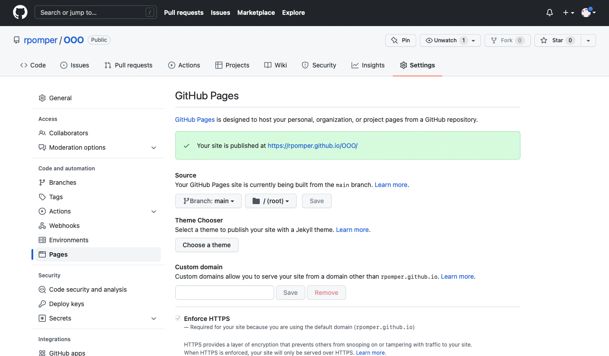

# Odd One Out

This is a digital version of the out one out task that was created with permission from Lucy Henry:

> Henry, L. A. (2001). How does the severity of a learning disability affect working memory performance? <i>Memory</i>, <i>9</i>(4–6), 233–247. https://doi.org/10.1080/09658210042000085

It is coded in JavaScript using the JsPsych framework created by Josh de Leeuw <https://www.jspsych.org/7.2/>:

> de Leeuw, J. R. (2015). jsPsych: A JavaScript library for creating behavioral experiments in a web browser. Behavior Research Methods, 47(1), 1-12. doi:10.3758/s13428-014-0458-y.

This project and the supporting documentation were created by Ron Pomper <https://rpomper.github.io>. And were last updated on 04/11/2022.

Please make sure to cite these sources in addition to this GitHub repository if you use this tool in your research.

__Table of Contents__:
* [Descripton of Task](#Description-of-Task)
* [Administration](#How-to-administer)
* [Saving to REDCap](#How-to-set-up-the-REDCap-project)
* [Exporting from REDCap](#Exporting-and-formatting-REDCap-data)
* [Clone GitHub repository](#How-to-clone-the-GitHub-repository)

## Description of Task 

In this task, participants are shown images of three similar-looking figures in a row: two of the figures are identical and the third differs slightly from the other two. The participant is tasked with clicking on the figure that is different from the others (__odd one out trial__). The figures are then replaced with images of three rectangular boxes in a row. The participant is then tasked with recalling and pointing to the position of the odd one out figure (__position recall trial__).

The task begins with two practice trials: one with a 1-item length (i.e., identify one odd one out before recalling its position) and one with a 2-item length (i.e., identifying two odd ones out before recalling their positions).

The task then consists of 6 blocks of test trials with each block increasing the number of items to recall (starting with 1-item length, ending with 6-item length). Each block contains four odd one out sequences and four position recall trials. Responses on position recall trials are scored correct only if the participant correctly identifies the positions for every odd one out figure in the sequence (e.g., all 6 positions in the 6th block). Note: when participants incorrectly identify which figure was the odd one out, this position is used as the target position on the position recall trial.

Administration of the task will automatically stop (i.e., before the end of the 6th block) when the participant answers incorrectly on two or more of the four position recall trials within a block.

The participant's visuospatial working memory is then quantified as the total number of position recall trials that were correct (with a maximum score of 24).

## How to administer

Participants complete this task online via a web browser. The code will work using both a computer (where participants click on the images) and via a tablet (where participants tap on the images). In principle, the code should also work on a phone, but I have not tested the dimensions (it may be difficult to see all of the images on a small screen).

When entering the URL for this task, there are two variables that can be embedded within the link:

* __sub__: this will be saved with the REDCap data as subject_num
* __api__: this will be used within the script to save the participant's responses to a REDCap project

To do this, append the following to the end of the URL:

  /?sub=Ron&api=BFAD4CCAEC8BCD7EFF59FD43E41F05CC

This project is hosted publicly via GitHub, so you can use the URL for this project:

  <https://rpomper.github.io/OOO/?sub=Ron&api=BFAD4CCAEC8BCD7EFF59FD43E41F05CC>

__Note__: Make sure to change the API token to your own REDCap Project. Otherwise you will be saving your data to the REDCap Project I created to test out this code (which you will not have access to)

Alternatively, if you would like to make any adjustments to the code, you can Clone the GitHub repository and host it yourself (more on that in the last section).

## How to set up the REDCap project

1. Create an empty project in REDCap. Click on the _Designer_ tab. Then click the pencil next to the _Instrument Name_ to modify the instrument:

    

2. Within the instrument create the following fields with the exact variable names (the script will be looking for these when saving the data to REDCap):

    

3. Next you'll need to enable the API token feature, which is not on by default. To do this, click on the _User Rights_ tab. Then click on your user name:

    

4. Scroll down and click on the two boxes next to API:

    

5. Refresh your webpage and click on the _API_ tab (which will now be visible!) and click the _Request API token_ button:

  

6. Once the administer approves this, copy and paste this number somewhere that is accessible. This is the information you will need to embed in the URL after "api=" (see above)

## Exporting and formatting REDCap data

The data is saved in JSON format, which can be challenging to work with in statistical software like R. In this repository <https://github.com/rpomper/OOO/tree/main/data>, I am sharing R code that will format the data, do some preliminary plots, and export two csv files.

1. In the REDCap project where you are saving the data, click on the __Data Exports, Reports, and Stats__ tab in the left panel.

2. In the All data row click on the __Export Data__ button.

3. Select the __CSV/Microsoft Excel (labels)__ option as the export format in the left panel. And click __Export Data__ on the bottom of the window.

  

4. Click the __EXCELCSV__ image to download the csv file.

  

5. Move this data to the same folder that contains the R script.

6. Make sure to adjust the `set_wd()` and `read.csv()` functions at the beginning so that the R script can access your data.

7. The R script is annotated to provide commentary on what each line of code is accomplishing. After formatting the data, it will:

* plot the average accuracy for __odd one out trials__ separately for each item-length (1 through 6)
* plot the average accuracy for __position recall trials__ separately for each item-length (1 through 6)
* plot the average maximum item-length achieved (i.e., each child's span).
* save a .csv file with the data for every trial for each participant
* save a .csv file with the total number of correct position recall trials and the maximum item-length achieved for position recall trials ("Max.Span") for each participant

## How to clone the GitHub repository

1. From this page (<https://github.com/rpomper/OOO>), click the _Code_ green box above and __Clone__ the repository to your own GitHub account.

2. Click on __Settings__ tab with the Gear icon along the top.

3. Click on the __Pages__ tab on the left panel (if it does not appear here, there's a link that will direct you there in the _General_ tab - you'll need to scroll down to find it)

  

4. By default __Source__ will be set to "None". Click the drop down box and select "main".

  

5. You may need to wait a few minutes, but after you refresh the page you will get a message confirming that the page is published and providing the URL.

  
